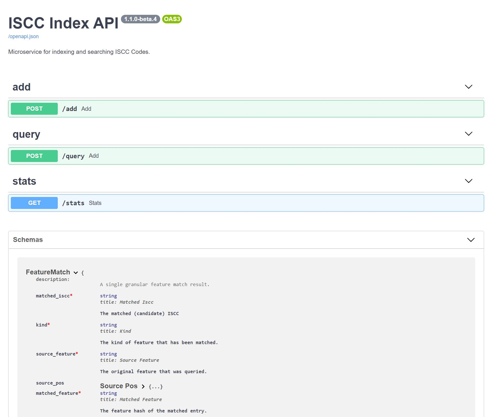

# iscc-index - ISCC Nearest Neighbor Index - REST OpenAPI

> A REST OpenAPI Backend for indexing [**ISCC codes**](https://iscc.codes) for digital media files.


The Webservice is build with [FastAPI](https://github.com/tiangolo/fastapi) and makes
use of the [ISCC reference implementation](<https://github.com/iscc/iscc-specs>).
It includes an interactive API documentation:




The Docker image is published at https://hub.docker.com/r/titusz/iscc-index


## Setup for development

If you are using [poetry](https://python-poetry.org/):

- After checkout cd into code directory and run 'poetry install' to install dependencies.
- Launch dev server with: 'uvicorn iscc_index.main:app --reload'
- See API docs at: http://127.0.0.1:8090


## Install via pip

```bash
$ pip3 install iscc-index
```

Run webservice via uvicorn

```bash
$ iscc-index
INFO:     Started server process [18800]
INFO:     Waiting for application startup.
INFO:     Application startup complete.
INFO:     Uvicorn running on http://127.0.0.1:8090 (Press CTRL+C to quit)
```

## License

MIT © 2021 Titusz Pan
